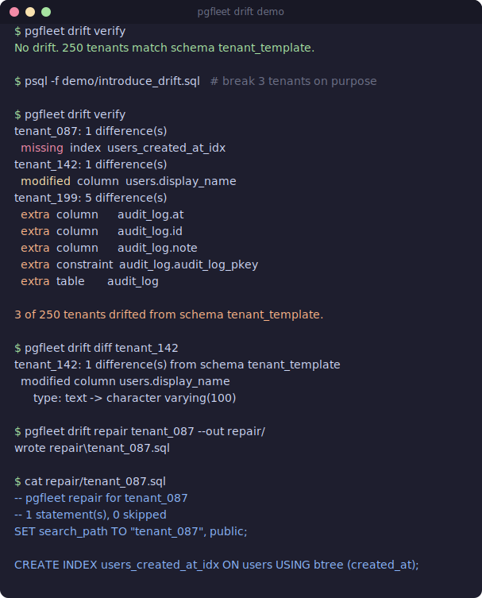

# pgfleet demo

A two-minute, 250-tenant demonstration: migrate a fleet, break three tenants on
purpose, then detect, explain, and repair the drift.

## Run it

From the repo root, with Docker and Go installed:

```
./demo/demo.sh
```

The script builds the binary, starts a Postgres container seeded with 250 tenant
schemas (`seed.sql`), migrates them, introduces drift in `tenant_087`,
`tenant_142`, and `tenant_199` (`introduce_drift.sql`), and walks through
`verify`, `diff`, and `repair`. Postgres is left running; stop it with
`docker compose down -v`.

## Files

- `seed.sql`: control table, 250 tenant schemas, and the canonical
  `tenant_template` reference. Loaded automatically when the container starts.
- `introduce_drift.sql`: the three deliberate mutations (a dropped index, a
  widened column, and a rogue table).
- `demo.sh`: the end-to-end walkthrough.
- `demo.tape`: a [VHS](https://github.com/charmbracelet/vhs) script. With `vhs`
  installed, `vhs demo/demo.tape` renders `demo.gif`.

## A captured run


